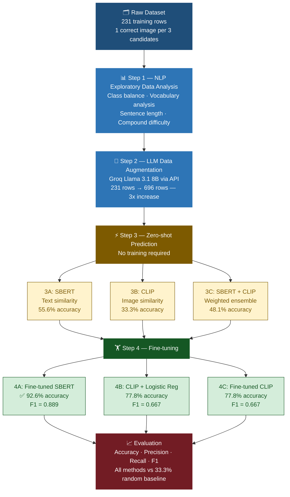

# Multimodal Idiom Understanding
### End-to-end NLP & Vision-Language Pipeline

[](https://python.org)
[](https://pytorch.org)
[](https://huggingface.co)
[](LICENSE)

---

## Overview

Given an idiomatic compound (e.g. *"hot potato"*, *"low-hanging fruit"*) used in a sentence
and three candidate images, the task is to predict which image correctly represents
the **figurative meaning** of the idiom in context.

This is framed as a **binary classification** problem. Random baseline = 33.3%.

---

## Results

| Method | Test Accuracy | Test F1 |
|---|---|---|
| Random Baseline | 33.3% | 0.333 |
| Zero-shot SBERT | 55.6% | 0.333 |
| Zero-shot CLIP | 33.3% | 0.000 |
| Zero-shot SBERT + CLIP | 48.1% | 0.222 |
| CLIP + Logistic Regression | 77.8% | 0.667 |
| Fine-tuned CLIP | 77.8% | 0.667 |
| **Fine-tuned SBERT** | **92.6%** | **0.889** |

> Fine-tuned SBERT achieved **92.6% test accuracy** — a 178% improvement over random baseline.

---

## Demo


---

## Pipeline



---

## Key Technical Highlights

- **LLM-based data augmentation** using Groq's Llama 3.1 API to triple training data
  while preserving label distribution
- **Zero-shot benchmarking** across text-only (SBERT) and multimodal (CLIP) approaches,
  revealing that literal vision-language models fail on figurative language
- **Fine-tuned Sentence-BERT** using CosineSimilarityLoss with validation-based
  checkpoint selection
- **Feature engineering** on frozen CLIP embeddings: 2048-dim vectors (sentence +
  caption + image + interaction term) fed into Logistic Regression
- **Contrastive fine-tuning of CLIP** — last 2 transformer blocks trained with BCE loss,
  gradient clipping, recovering from 0% → 77.8% F1

---

## Tech Stack

| Category | Tools |
|---|---|
| Deep Learning | PyTorch, HuggingFace Transformers |
| Vision-Language | CLIP (OpenAI ViT-B/32) |
| NLP | Sentence-Transformers (SBERT) |
| ML | Scikit-learn, Logistic Regression |
| LLM API | Groq (Llama 3.1 8B Instant) |
| Data | Pandas, NumPy |
| Visualisation | Matplotlib |
| Environment | Google Colab, Python 3.10 |

---

## Project Structure

```text
.
├── src/                                      # Colab notebook
│   └── multimodal_idiom_understanding.ipynb  # Main notebook
├── results/                                  # Output figures and screenshots
└── eda/                                      # Exploratory Data Analysis
```

---

## Installation

```bash
git clone https://github.com/YOUR_USERNAME/multimodal-idiom-understanding.git
cd multimodal-idiom-understanding
pip install -r requirements.txt
```

---

## Dataset

The dataset is from the
[SemEval-2022 Task 2](https://competitions.codalab.org/competitions/34285)
shared task on Multilingual Idiomaticity Detection.
Due to licensing, raw data files are not included.
Download from your course portal and place under `data/`.

---

## Citation

```bibtex
@inproceedings{tayyarmadabushi2022semeval,
  title={SemEval-2022 Task 2: Multilingual Idiomaticity Detection and Sentence Embedding},
  author={Tayyar Madabushi, Harish and others},
  booktitle={Proceedings of SemEval-2022},
  year={2022}
}
```
